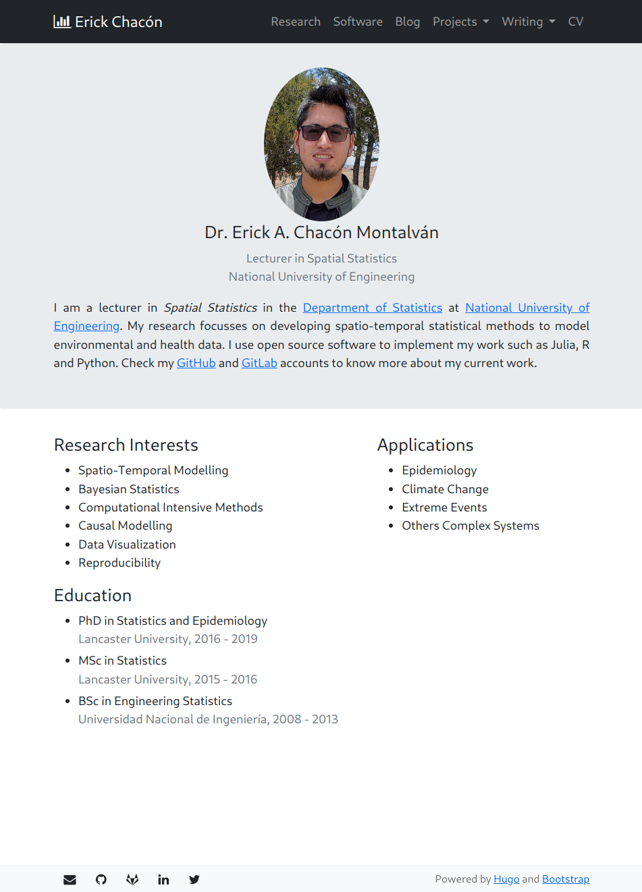

# scholar
Hugo theme for researchers and academic people powered by bootstrap. Suggested to be used with blogdown R package.

# Scholar

## About

[Hugo](https://gohugo.io/) theme using [Bootstrap
5](https://getbootstrap.com/). The template is for a personal webpage to show
your information, research, blog, so on.

## Features

- It includes a sticky header. You can define the desired links into the
  header. These elements should be defined in `[menu.main]` on the
  `config.toml` file.
- It includes a sticky footer. You can use social media links on the footer
  defining `[params.social]` on the `config.toml` file. The icons are used from
  `fontawesome`.

## Examples

- Check the `config-example.toml` to define the desired attributes.
- Check my personal webpage [Dr. Erick A. Chacón-Montalván](https://erickchacon.gitlab.io/).
